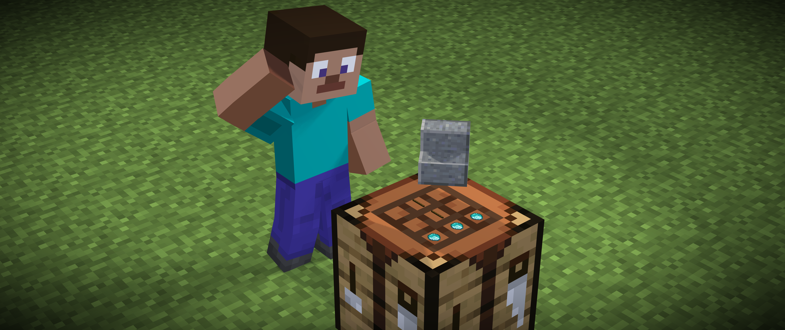

# Amnesia

Amnesia is a highly configurable Minecraft plugin for PaperMC and Folia servers that shuffles crafting recipes. It offers two distinct shuffling modes: random item replacement and recipe result swapping.

> **📘 Project Documentation**: For the complete technical specification, architecture details, and project vision, see [SOURCE-OF-TRUTH.md](SOURCE-OF-TRUTH.md). This document serves as the definitive reference for understanding what Amnesia should be in its completed state.

## Features

- **Recipe Shuffling:** Two modes of recipe manipulation:
  - **Random Item Mode:** Recipe outputs are replaced with random items from the Minecraft item registry.
  - **Recipe Result Shuffle Mode:** Recipe outputs are shuffled amongst existing recipes.
- **Timer-Based Reshuffling:** Automatic reshuffling of recipes at configurable intervals with countdown notifications.
- **Seed-Based Rotations:** Ability to use seeds to generate and recall specific recipe shuffles.
- **Cross-Restart Synchronization:** Recipe shuffle state and timer settings persist across server restarts.
- **Client Recipe Synchronization:** Control how clients handle recipe changes with three different modes.
- **Command-Line Interface:** Comprehensive commands for managing shuffling, timer, seed, and configuration.
- **Configuration File:** YAML based configuration for persistent settings and customization.
- **Performance Focused:** Designed for minimal server impact, especially on Folia servers.
- **User Notifications:** Clear and informative messages to players about upcoming and executed recipe shuffles.

## Commands

- `/amnesia shuffle [mode] [seed <value>|random]` - Shuffles recipes using the specified mode and optionally a seed.
- `/amnesia timer [enable|disable|interval <seconds>]` - Manages the timer-based reshuffling.
- `/amnesia seed [view|set <seed>|random]` - Manages the shuffle seed.
- `/amnesia reload` - Reloads the plugin configuration.

## Permissions

- `amnesia.command.shuffle` - Allows use of `/amnesia shuffle` command.
- `amnesia.command.timer` - Allows use of `/amnesia timer` command.
- `amnesia.command.seed` - Allows use of `/amnesia seed` command.
- `amnesia.command.reload` - Allows use of `/amnesia reload` command.

## Configuration

The plugin uses a `config.yml` file for configuration settings and a `data.yml` file for persistent data. Here's an example configuration:

```yaml
# Shuffle mode: "random_item" or "recipe_result"
shuffle-mode: "random_item"

# Timer interval in seconds (default: 3600 - 1 hour)
timer-interval: 3600

# Whether the timer-based reshuffling is enabled by default
timer-enabled: false

# Client recipe synchronization mode:
# "resync" - Clients will be resynced with the new recipes (default)
# "clear" - Clients won't get any recipes
# "vanilla" - Don't touch client recipes and let Minecraft handle it
client-sync-mode: "vanilla"

# List of recipe keys to exclude from shuffling
excluded-recipes:
  # - "minecraft:stick"

# List of item keys to exclude from being selected in random_item shuffle mode
excluded-random-items:
  - "minecraft:air"
  - "minecraft:barrier"
  # ... more items

# Countdown intervals (in seconds) for timer notifications
notification-intervals:
  - 300 # 5 minutes
  - 60  # 1 minute
  - 30  # 30 seconds
  # ... more intervals

# Customizable notification messages
notification-messages:
  countdown-5-minutes: "<gold>5 minutes until recipes are shuffled!</gold>"
  # ... more messages
```

The `data.yml` file stores persistent data such as:

```yaml
# The seed used for recipe shuffling
seed: 123456789

# Whether the seed was set by the user (true) or generated randomly (false)
user-set-seed: false

# Whether recipes are currently shuffled
is-shuffled: false

# When recipes were last shuffled (milliseconds since epoch)
last-shuffle-time: 0
```

## Installation

1. Download the latest release from the releases page.
2. Place the JAR file in your server's `plugins` folder.
3. Start or restart your server.
4. Configure the plugin by editing the `config.yml` file in the `plugins/Amnesia` folder.

## Support

If you encounter any issues or have suggestions, please open an issue on the GitHub repository.
